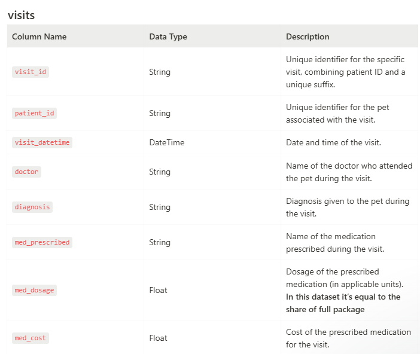
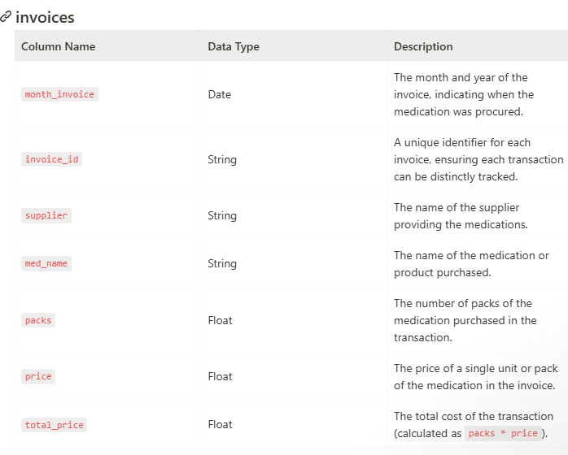

# 🚀 Apex Pet Health: Building a Fully Automated, E2E Analytics Pipeline on Google Cloud ☁️


## Project purpose 🧭

Delighted to share my latest project — an end-to-end Analytics Engineering solution for a veterinary clinic focused on optimizing patient management and financial health. The core challenge: move from manual, inefficient data handling to real-time insights and full automation.

I designed and deployed a **production-ready ETL-pipeline** using the **Google Cloud Platform** (GCP), demonstrating how modern tooling can turn raw data into fast, high-impact decisions.

### ⚙️ Tech Stack 

* **Cloud Platform**: Google Cloud Platform (GCP) ☁️ (Automation, Service Accounts, Data Transfer).

* **Data Warehouse**: BigQuery (Used for high-speed storage, cleaning, transformation, and direct BI connection).

* **Visualization**: Looker Studio (For creating interactive KPI dashboards and data storytelling).

* **Foundational Tech**: SQL, Python, PostgreSQL, Git.

### 🧠 The Learning Journey: From Manual Setup to Enterprise Automation

This project's real value was stretching beyond the requirements to learn the pros and cons of different approaches. I conducted a **comparative analysis of three pipeline architectures** to understand efficiency and readiness:

1. **Local/Manual ⭐**: Pure PostgreSQL setup for all tasks—100% manual and inefficient.

2. **Pythonic ⭐⭐**: Local storage, Python cleaning/modeling, BigQuery ingestion via API—partially automated.

3. **Google Cloud ⭐⭐⭐** (Final Delivery): Fully automated E2E pipeline using GCP Services (Storage, Data Transfer, BigQuery Pipeline functions) for a highly efficient, production-ready solution.

> **Key takeaway**: GCP allows for seamless tool integration, enabling a truly automated, enterprise-ready data delivery process.

### 🛠️ Technical Deep Dive

* **Full Automation**: Implemented a 100% automated ETL pipeline on GCP (replacing manual, local setups) using Scheduled Data Transfer into BigQuery.

* **Advanced Data Cleaning**: Used SQL Regular Expressions (RegEx) to rigorously clean and standardize messy source fields (e.g., owner names, phone numbers) ensuring high data quality.

* **Data Modeling**: Designed two distinct BigQuery data models to optimize performance for specific business domains (Medication Inventory/Costs and Patient Diagnosis Trends).

### 📈 Business Value & Actionable Insights

The analysis and visualization in Looker delivered immediate, high-impact findings for executive leadership.

[Link](https://lookerstudio.google.com/s/k1Ack_vEUV8) to online dashboard

* **Financial Waste**: Identified a significant *inventory issue*, revealing the clinic purchased €2.1M in medications while only prescribing €1.3M, tying up substantial capital.

* **Key Disease Trends**: Confirmed Hypertrophic Cardiomyopathy and Hip Dysplasia as top diagnoses, but uncovered that Cancer treatments led in average cost per patient (€125/visit), informing pricing and inventory needs.

* **Performance Drop**: The dashboard revealed a *strong decrease in patient visits*, triggering immediate recommendations for business investigation and intervention.

* **Upside potential**: We treat mainly cats, dogs and hamsters. We should investigate in diversifying.

This project validates my ability to build end-to-end data products, manage cloud-native resources, and communicate data insights effectively to drive core business decisions. Ready for the next challenge! 🚀


# Looking under the hood ⚡

The following is targeted at the technically interested reader.


### The data

The data is given in three CSV-files requiring cleaning and transformation into two different data models each suitable to answer two different sets of business questions via dashboarding in Looker Studio. 

| `patients.csv` | `visits.csv`           | `invoices.csv`      |  
|------------------|---------------------------|----------------------|
| <a href="Images/table_patients.png"></a> | <a href="Images/table_visits.png"></a> | <a href="Images/table_invoices.png"></a> |


### Two datamodels

Best practice is to first consider business questions and dashboard requirements and then reverse engineer backwards to a suitable datamodel. 

As the business questions were adressing `two domains`, costs of medication and inventory data (in/out) and patient diagnosis, prescribed meds, breed, type I opted for `two data models` as well. This allows smooth transformation and aggregating data for good performance in final visualization with Looker Studio.

### Cleaning requirements

Initial quality check showed minor [anomalies](Images/GCP_05_data_anomalies.jpg) which can be cleaned at ease.

* ``Name fields`` including all trouble (Prefix, suffix, lower-/upper case confusion, firstname, lastname all in one cell)
* ``Inconsistencies`` in upper lower case for string columns
* ``Missing values`` (real NA and '') and white space
* Inconsistent categorical data (e.g. 'Unknown' and 'No breed')
* ``Phone numbers`` with ``non-numeric characters`` like '-+,()'

For cleaning of name field and phone numbers **Regular Expressions** are a wonderful solution, fast and efficient. *SQL example*:
```
-- Extract prefix (title)
  REGEXP_EXTRACT(owner_name, r'(?i)\b(Dr|Mr|Mrs|Ms|Prof)\.?\b') AS extracted_prefix,
  -- Extract suffix
  REGEXP_EXTRACT(owner_name, r'(?i)\b(Jr|Sr|II|III|IV|PhD|MD|DDS|Esq)\.?\b') AS extracted_suffix,
  -- clean name field, trim and correct upper lower case
  INITCAP(
    TRIM(
      REGEXP_REPLACE(
        REGEXP_REPLACE(
          REGEXP_REPLACE(
            owner_name,
            r'(?i)\b(Dr|Mr|Mrs|Ms|Prof)\.?\b', ''),
          r'(?i)\b(Jr|Sr|II|III|IV|PhD|MD|DDS|Esq)\.?\b',''),
        r'\.', '')))  -- Remove leftover periods
  AS owner_name_clean,
```

### Pipeline and Automation

| Step | Solution           | Comments      |  
|------------------|---------------------------|----------------------|
| Data upload | [Google Cloud storage bucket](Images/GCP_01_cloud_storage.jpg) with access rights for customer | Use personalized account of Service Account for M:M communiation. |
| Data ingestion | Scheduled [Google Data Transfer](Images/GCP_04_automated_datatransfer_check.jpg) into prepared Big Query datasets and tables. Data gets mirrored for full update. | Chance for improvement: Use of Google Cloud Functions to automatically detect new files and start workflow |
| ETL-Pipeline | Separate scripts for cleaning and transformation on three [data layers](Images/gcp_07_tables_ready.jpg) (stage, integration, consumer). Automation via [Big Query Pipeline](Images/gcp_08_pipeline_scheduler.jpg) functionality | Manual script for [quality check](Images/gcp_09_quality_control.jpg). Change for improvement: Automization with DBT |
| Visualization | [Looker Studio](https://lookerstudio.google.com/s/k1Ack_vEUV8) directly connected to Big Query with data refresh every 12 hours | Chance for improvement: Use Google Groups for better access control | 

### Repo structure
```
├── Code/
│ `Option 1: PostgreSQL`
│   ├── var1_postgresql/ 
│   │   ├── apex_health_consumer_ddl.sql
│   │   ├── apex_health_quality_control.sql
│   │   └── apex_health_stage_ddl.sql
│ `Option 2: Pythonic`
│   ├── var2_python_pipeline/ 
│   │   └── apex_health_integration_cleaning.ipynb
│ `Option 3: Google Cloud`
│   └── var3_gcp/
│       ├── apex_consumer_layer_scripts.sql
│       ├── apex_health_business_questions.sql
│       ├── apex_integration_layer_scripts.sql
│       └── apex_quality_control.sql
│ `Customer deliverables`
├── Deliverables/
│   ├── Looker Studio Report.url
│   ├── step1.sql - for cleaning and aggregation
│   └── step2.sql - for answering business questions
│ `Defaults`
├── Images/
├── .gitattributes
├── .gitignore
├── license
└── readme.md
```