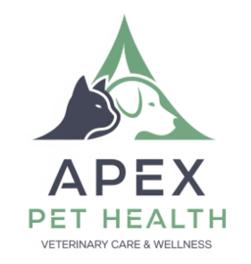

# Apex Pet Health 🐾

> * Pipelines, EDA, Cleaning, Data Modeling, Automation
> * KPI-dashboards, answering business questions, data storytelling
> * PostgreSQL, Python, Google Cloud Platform, BigQuery and Looker Studio



## Project purpose 🧭

A veterinary clinic wants to improve  patient management processes by bringing most used data into a cloud platform and using real-time dashboard information to make decisions better and quicker. 

##### Key requirements
1. `Auditing Medication Purchases and Expenses`: They need a way to easily track and analyze their annual medication spending.
2. `Monitoring Diagnoses and Disease Trends`: They want to identify common diagnoses and diseases segmented by pet type and breed. This information will help them plan staffing needs and optimize medication procurement.

##### Tasks and Deliverables

* `Looker Studio Report` designed
* `Data Ingestion` set up and automated 
* `Cleaning and transformation` of data 
* `Data models` designed and implemented in BigQuery 
* `ETL Pipelines` (clean, transform) production ready
* `Live presentation` to clinic directors

##### The Product


[Link](https://lookerstudio.google.com/s/k1Ack_vEUV8) to online dashboard

##### Fully automated setup in GCP

In this project I stretched myself by not just fulfilling business requirements, but also learning pros and cons about different approaches. From a local and manual setup to a fully automated setup in the Google Cloud Platform. Read more about it [here](https://github.com/ThorstenWeberGER/Healthtail/tree/main?tab=readme-ov-file#pipeline-and-automation).

## Analysis

The dataset represents three years 2024-2026 (yes we are in the future already) of pet patients visits, diagnosis, purchased and prescribed medications. The following insights are based on CY 2025 with 78k pet patients visits.

##### Key insights regarding diagnosis

* **Top two diagnosis** are **Hypertrophic** Cardiomyopathy (Hcm) with 5.4k cases and **Hip Dysplasia** with 4k cases in CY 2025
* Data suggests, **that age has an significant effect on diagnosis**. Deeper analysis required as some diagnosis should happen more often with older patients. I suggest to analyse diagnosis in relation to different lifetime expectations. 
* **Highest average meds cost for cancer**: Although Hyptertophic is the most commong diagnosis, Cancer leads in incurred medications costs with costs of 322k € in total for all pet owners. This is due to high costs per visit of 125€ on average.  

##### Key insights regarding business performance

* **Declining visits in 2025** In 2024 our business was increasing with a peak at end of 2024 - bad news is that in 2025 we see a strong decrease in visits over the year.
* **We're building inventory and tying up too much capital as a result.** Our doctors only prescribe meds in value of 1,3M € this year whereas we purchased meds of 2,1M € value
* **Upside potential** We treat mainly cats, dogs and hamsters. We should investigate in diversifying.

**Further Recommendations**
* **Increase data quality** by advising frontdesk to clearly enter data for breed and we should implement separate fields in our data entry form for sex of owner and names titles. Direct marketing activities will benefit. 
* **Automated warnings for low stock** levels could be implemented - for this we need an inventory count once a year

## Skills built 🚀

This project showed to be really exciting. A end-2-end project which I could apply my skills on and additionally grow by learning how to use **Google Cloud Platform** to built **fully automated ETL-pipelines** and finally answer business questions with Looker Reports.

* **Data Handling & Processing**: SQL, data cleaning, automate ETL-pipelines including data ingestation, building appropriate data models, automation of processes
* **Data Visualization**: Designing dashboards with clarity and interactivity, storytelling with data
* **Business & Domain Understanding**: Translation business questions into data solutions, understanding KPIs and metrics, connecting data insights to decision-making
* **Communication**: Clear reporting for non-technical stakeholders, presentations and executive summaries 
* **Tech stack**: GCP, BigQuery, Data Transfer, Data Transfer, APIs, Service Accounts, SQL, Python, Looker Studio, PostgreSQL, Git


## Looking under the hood ⚡

### One project three possible approaches

**How and why?** I started off easy with utilizing *only PostgreSQL* database for all tasks of loading, transforming, cleaning and model building. But this did not satisfy me. Because it is *not efficient*. You need to handel different tools which are not connected. And all jobs are manually, not scheduled. Thus I started digging deeper.... 

Finally I decided on **three approaches** for learning and comparison:
| PostgreSQL <br> ⭐ | Pythonic <br> ⭐⭐ | Google Cloud way <br> ⭐⭐⭐ |
|----------|----------|----------|
| - fully local setup <br> - pure SQL <br> - 100% manual <br> - Tableau not connected | - local storage<br> - Cleaning & modeling with Python <br> - Data Ingestion to BigQuery via API<br> - Partly automized | - Fully automated ETL-pipeline<br>- Stage, Integration, Consumer layer<br> - Cleaning and transformation with SQL triggered via Pipeline<br> - Tableau Looker Report directly connected to BigQuery

**My key takeways**: The Google Cloud Platform allowed an amazing integration of tools required the final delivery of the dashboard based on raw data, allowing a fully automated end-two-end process across various tools. `Highly efficient and production ready for enterprise implementation`.

### The data

The data is given in three CSV-files requiring cleaning and transformation into two different data models each suitable to answer two different sets of business questions via dashboarding in Looker Studio. 

| `patients.csv` | `visits.csv`           | `invoices.csv`      |  
|------------------|---------------------------|----------------------|
| <a href="Images/table_patients.png"></a> | <a href="https://github.com/ThorstenWeberGER/Healthtail/blob/4fedd0e9020feacfe9ad9830531747b64a882652/Images/table_visits.png"></a> | <a href="https://github.com/ThorstenWeberGER/Healthtail/blob/4fedd0e9020feacfe9ad9830531747b64a882652/Images/table_invoices.png"></a> |


### Two datamodels

Best practice is to first consider business questions and dashboard requirements and then reverse engineer backwards to a suitable datamodel. 

As the business questions were adressing `two domains`, costs of medication and inventory data (in/out) and patient diagnosis, prescribed meds, breed, type I opted for `two data models` as well. This allows smooth transformation and aggregating data for good performance in final visualization with Looker Studio.

### Cleaning requirements

Initial quality check showed minor [anomalies](Images/GCP_05_data_anomalies.jpg) which can be cleaned at ease.

* ``Name fields`` including all trouble (Prefix, suffix, lower-/upper case confusion, firstname, lastname all in one cell)
* ``Inconsistencies`` in upper lower case for string columns
* ``Missing values`` (real NA and '') and white space
* Inconsistent categorical data (e.g. 'Unknown' and 'No breed')
* ``Phone numbers`` with ``non-numeric characters`` like '-+,()'

For cleaning of name field and phone numbers **Regular Expressions** are a wonderful solution, fast and efficient. *SQL example*:
```
-- Extract prefix (title)
  REGEXP_EXTRACT(owner_name, r'(?i)\b(Dr|Mr|Mrs|Ms|Prof)\.?\b') AS extracted_prefix,
  -- Extract suffix
  REGEXP_EXTRACT(owner_name, r'(?i)\b(Jr|Sr|II|III|IV|PhD|MD|DDS|Esq)\.?\b') AS extracted_suffix,
  -- clean name field, trim and correct upper lower case
  INITCAP(
    TRIM(
      REGEXP_REPLACE(
        REGEXP_REPLACE(
          REGEXP_REPLACE(
            owner_name,
            r'(?i)\b(Dr|Mr|Mrs|Ms|Prof)\.?\b', ''),
          r'(?i)\b(Jr|Sr|II|III|IV|PhD|MD|DDS|Esq)\.?\b',''),
        r'\.', '')))  -- Remove leftover periods
  AS owner_name_clean,
```

### Pipeline and Automation

| Step | Solution           | Comments      |  
|------------------|---------------------------|----------------------|
| Data upload | [Google Cloud storage bucket](Images/GCP_01_cloud_storage.jpg) with access rights for customer | Use personalized account of Service Account for M:M communiation. |
| Data ingestion | Scheduled [Google Data Transfer](Images/GCP_04_automated_datatransfer_check.jpg) into prepared Big Query datasets and tables. Data gets mirrored for full update. | Chance for improvement: Use of Google Cloud Functions to automatically detect new files and start workflow |
| ETL-Pipeline | Separate scripts for cleaning and transformation on three [data layers](Images/gcp_07_tables_ready.jpg) (stage, integration, consumer). Automation via [Big Query Pipeline](Images/gcp_08_pipeline_scheduler.jpg) functionality | Manual script for [quality check](Images/gcp_09_quality_control.jpg). Change for improvement: Automization with DBT |
| Visualization | [Looker Studio](https://lookerstudio.google.com/s/k1Ack_vEUV8) directly connected to Big Query with data refresh every 12 hours | Chance for improvement: Use Google Groups for better access control | 

### Repo structure
```
├── Code/
│ `Option 1: PostgreSQL`
│   ├── var1_postgresql/ 
│   │   ├── apex_health_consumer_ddl.sql
│   │   ├── apex_health_quality_control.sql
│   │   └── apex_health_stage_ddl.sql
│ `Option 2: Pythonic`
│   ├── var2_python_pipeline/ 
│   │   └── apex_health_integration_cleaning.ipynb
│ `Option 3: Google Cloud`
│   └── var3_gcp/
│       ├── apex_consumer_layer_scripts.sql
│       ├── apex_health_business_questions.sql
│       ├── apex_integration_layer_scripts.sql
│       └── apex_quality_control.sql
│ `Customer deliverables`
├── Deliverables/
│   ├── Looker Studio Report.url
│   ├── step1.sql - for cleaning and aggregation
│   └── step2.sql - for answering business questions
│ `Defaults`
├── Images/
├── .gitattributes
├── .gitignore
├── license
└── readme.md
```